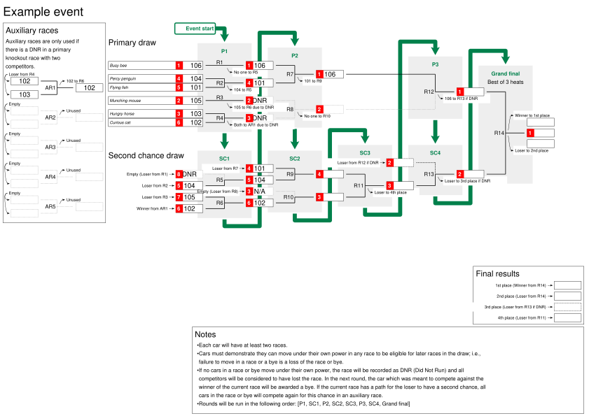
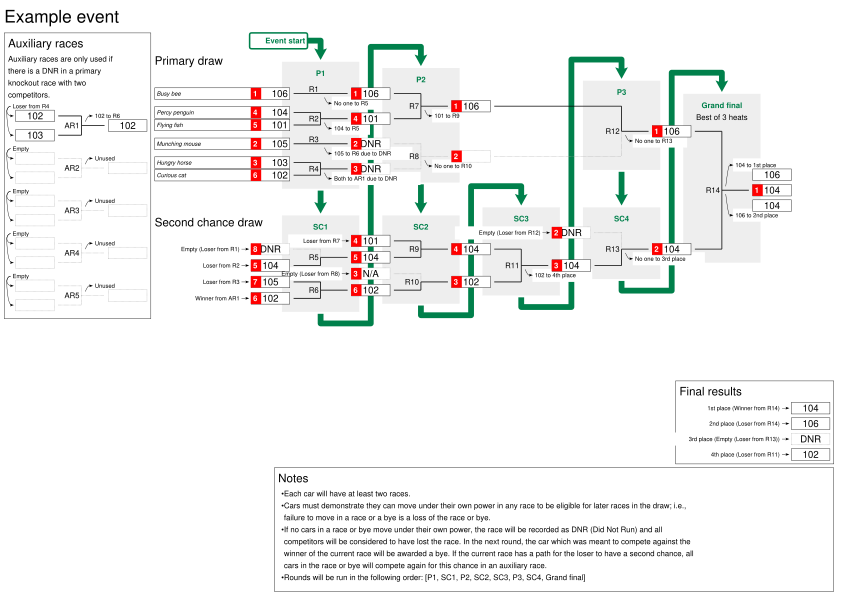

# Solar challenge draw: example event <!-- omit in toc -->
This is an example event to demonstrate seeding and the slightly modified double elimination draw. All competitors will have at least two races. One of the main features of this particular system is that it allows for the situation where both competitors “lose” by not running in a knockout race.

## Contents <!-- omit in toc -->

## Event structure
The event consists of two main brackets; a *primary draw* (also known as the *winner's bracket*) and the *second chance draw* (also known as the *loser's bracket*). There are also a collection of *auxiliary races* and a *grand final*.

### Primary draw
The *primary draw* runs as a traditional, single elimination competition where all cars enter round one and are gradually knocked out until there is only a single car left that has never lost a race. This car will then join the winner of the *second chance draw* for the *grand final*.

### Second chance draw
The *second chance draw* allows a chance for redemption once a car is knocked out of the *primary draw*. It consists of alternating rounds that add in cars that have been knocked of the *primary draw* and consolidate the field to halve the number of competitors. This means that a car that loses the first round of the primary draw would need to win many more races in the *second chance draw* to win the competition than if they had remained in the *primary draw*.

### Auxiliary races
The main twist for this event over a standard double elimination event is that it is possible for all competitors in a race or bye to lose. The reason for implementing this system is for fairness in the event that neither car is able to move under its own power. This could occur due to various combinations of poor lighting conditions, mechanical and electrical issues with the cars.

*Auxiliary races* allow a chance for one of the cars to re-enter the competition in the *second chance draw* and preserve the minimum of two races for each car guarantee. The outcome is considered *Did Not Run (DNR)* when both cars in a race (or the sole competitor in a bye) fail to move. A bye is awarded to whoever was meant to be racing the winner of this race in the next round. If the race with the *DNR* is in the *primary draw*, then an *auxiliary race* is run prior to the next *second chance* round to determine which, if any car should be allowed to use the available *second chance* opportunity.

### Grand final
The grand final is implemented as a best of three races. This is not strictly correct for a double elimination tournament, however is slightly simpler to understand and provides a little more excitement.

## Entrants
For this example, assume we have a small field 6 cars. The round-robin has been completed, and each car has been assigned a number of points (more points means a higher ranking). The cars are as follows in the table:

|   Car ID | Car name       |   Points |
|---------:|:---------------|---------:|
|      101 | Flying fish    |        1 |
|      102 | Curious cat    |        1 |
|      103 | Hungry horse   |        2 |
|      104 | Percy penguin  |        2 |
|      105 | Munching mouse |        4 |
|      106 | Busy bee       |        5 |

## Initial seed

Seeding (allocating cars to specific races in round one) is important for several reasons outlined by Schwenk[[1]](#reference-1). The article lists several axioms to consider for optimally seeding a knockout competition. These include:
- **Delayed confrontation:** The highest rated cars should not meet until later in the competition. This avoids the situation where the most competitive entrants meet and knock each other out in the first round.
- **Sincerity rewarded:** A higher-ranked car should never be penalised by giving it comparatively more difficult competitors than a lower ranked car. Whilst unlikely to occur in a solar car competition, this aims to discourage competitors from deliberately losing a race in the hopes of getting an easier win later on.
- **Favouritism minimised:** The competition should be structured to minimise favouritism to any particular seed. An example of favouritism would be giving the predicted first place an easy path through by racing the bottom of the field only whilst making the predicted second place race the rest of the top half of the field.

As well as allowing competitors to practice and fine tune their cars, the round-robin provides a very rough indicator of where each car may place in the event, which is used for seeding. Let's sort the table of cars by their round-robin points and assign an estimated finishing place. Ties between cars with the same number of points are settled at random. The race draw needs a power of two races (2, 4, 8, 16, ...), so let's add some placeholders to bring the number of entrants up to 8 (4 races). Races with an entrant scheduled to compete with a placeholder will become byes.

|   Estimated place | Car ID   | Car name       |   Points |
|------------------:|:---------|:---------------|---------:|
|                 1 | 106      | Busy bee       |        5 |
|                 2 | 105      | Munching mouse |        4 |
|                 3 | 104      | Percy penguin  |        2 |
|                 4 | 103      | Hungry horse   |        2 |
|                 5 | 101      | Flying fish    |        1 |
|                 6 | 102      | Curious cat    |        1 |
|                 7 | -        | -              |        0 |
|                 8 | -        | -              |        0 |

The *standard method* Schwenk describes is used in this draw. The predicted first place car is paired with the last place and the predicted second place car is paired with the second last place. These are located on opposite halves of the draw to make it impossible for the predicted first and second place cars to meet until the last round of the primary draw (if they are still in it). This pattern continues for the remaining cars.

The links between the primary and second chance races do not always strictly follow the *sincerity rewarded* axiom in later rounds. This is because of a preference to reduce repeat races with the same competitors.

Now it's time to assign cars to races in round 1 using the *standard method* that Schwenk describes. Because there are 6 competitors (8 with the placeholders), round 1 will have 4 races. We want the theoretically most competitive cars - *Busy bee* (106) and *Munching mouse* (105) - to not race each other for as long as possible. We do this by putting them is separate halves of the round one bracket where they can only meet later on in the event if they make it that far. Likewise, we wish to delay races between the third and fourth places - *Percy penguin* (104) and *Hungry horse* (103) - so place these on separate halves as far away from the first and second seeds as possible. This process continues until all competitors are assigned to a race. Note that this always ends up with the highest ranked seed racing the lowest, the second-highest racing the second lowest and so on.

Races where a competitor is running against a placeholder are replaced with byes. For fairness, there is a requirement that cars with a bye demonstrate they can move under their own power. Thus, it is still possible to lose a bye.

With all round 1 races assigned, we have our initial seed as shown below. The numbers in red show the predicted seed at each point if every race plays out as predicted (extremely unlikely).

    

    

## Event progress

### Round P1

In this round:
- *Busy bee* (106) successfully moves under its own power to complete its bye (race 1). *Busy bee* (106) will next compete in race 7 in round P2.
- Despite being ranked lower, *Flying fish* (101) wins against *Percy penguin* (104). *Flying fish* (101) will next compete in race 7 against *Busy bee* (106). *Percy penguin* (104) is not out of the competition yet and will now enter the second chance draw.
- Despite having a bye, *Munching mouse* (105) is not able to move under its own power and did not run (DNR). *Munching mouse* (105) will enter the second chance rounds.
- Neither *Hungry horse* (103) nor *Curious cat* (102) were able to move in race 4 and received a DNR result. Because there is only a single position available in the second chance draw, auxiliary race 1 will be used to determine the car to progress to the second chance bracket.

    

    

### Round SC1

- Auxiliary race 1 is used to determine which of *Curious cat* (102) and *Hungry horse* (103) will compete against *Munching mouse* (105) in race 6. *Curious cat* (102) wins the auxiliary race. *Hungry horse* (103) is out of the competition.
- Because *Busy bee* (105) ran successfully in its bye in race 1, *Percy penguin* (104) has its own bye in race 5. *Percy penguin* (104) moved under its own power and continues to the next round.
- *Curious cat* (102) wins against *Munching mouse* (105) in race 6 and advances to the next round. *Munching mouse* (106) is out of the competition.

    

    

### Round P2
- *Busy bee* (106) wins against *Flying fish* (101) in race 7.
- Race 8 has no competitors available as races 3 and 4 were both DNR. This is hopefully a relatively unusual situation given the small size of the field in this example. Race 12 in round P3 will therefore be a bye.

    

    

### Round SC2
- *Flying fish* (101) is given a second chance against *Percy penguin* (104) in race 9. *Percy penguin* (104) wins and *Flying fish* (101) is out of the competition.
- *Curious cat* (102) has a bye and passes successfully in race 10.

    

    

### Round SC3
- There is a single race 11 in this round between *Percy penguin* (104) and *Curious cat* (102). *Percy penguin* (104) wins and *Curious cat* (102) is out of the competition with what would normally be an overall fourth placing.

    

    

### Round P3
- Because race 8 has no competitors, *Busy bee* (106) has a bye in race 12. *Busy bee* (106) passes and is into the grand final.

    

    

### Round SC4
- Race 13 is a bye for *Percy penguin* (104), which passes compete in the grand final next round. The loser of race 13 would normally achieve third place in the competition, however this is not possible due to the fact this race was a bye.

    

    

### Grand final
- The grand final is a best of three races between *Busy bee* (106) and *Percy penguin* (104). *Busy bee* (106) has not yet lost a race, whilst *Percy penguin* (104) has only lost one race so far.
- *Busy bee* (106) wins the first heat.
- *Percy penguin* (104) wins the second and third heats.
- *Percy penguin* (104) has won the best of three and is the winner of the competition. *Busy bee* (106) comes second.

    

    

## Summary
> [!NOTE]
> TODO

- Show table of predicted vs actual outcomes.
- Bump 4th place to third.
- Mention that this is a worst case due to small field and DNRs.

## References

- [1] Allen J. Schwenk, “What Is the Correct Way to Seed a Knockout Tournament?,” The American Mathematical Monthly, vol. 107, no. 2, pp. 140–150, Feb. 2000, [Online]. Available: http://www.oxfordcroquet.com/tech/knockout3/What_is_the_Correct_Way_to_Seed_a_Knockout_Tournam.pdf

